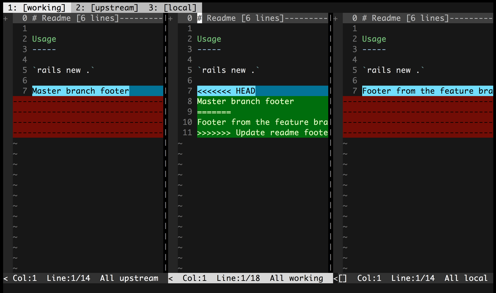
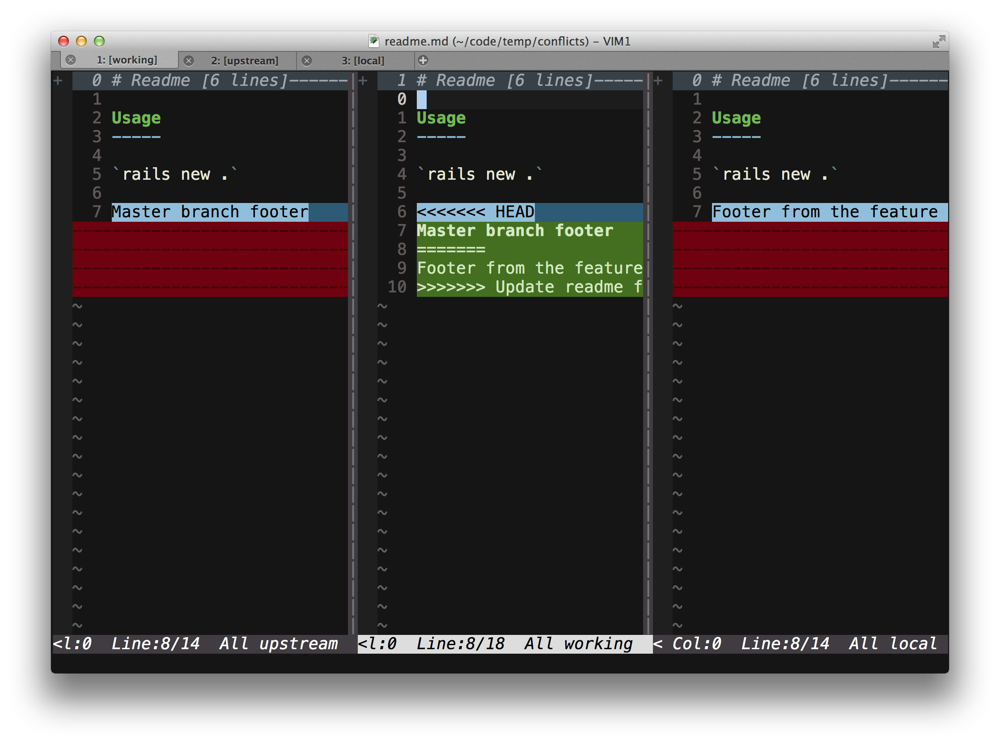
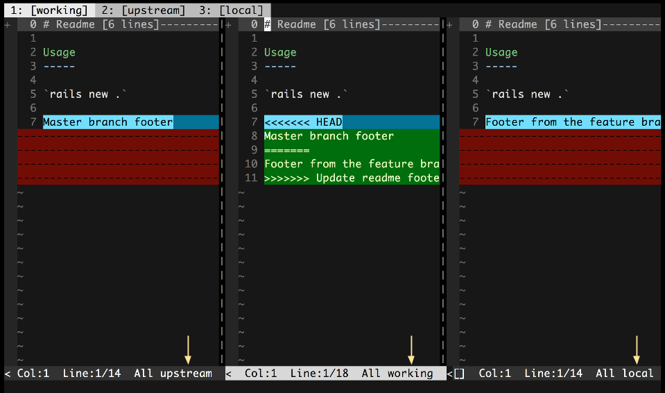

Conflicted
==========

Conflicted is a Vim plugin that aids in resolving git merge and rebase
conflicts. It relies on [tpope's fugitive plugin][] to do the heavy lifting and
provides a few wrapper commands and a streamlined workflow to make resolving
conflicts much more straightforward.

[tpope's fugitive plugin]: https://github.com/tpope/vim-fugitive

Usage
-----

### Commands

Conflicted provides three primary commands for working with conflicts:

**Conflicted**

`Conflicted` will add all the conflicted files to Vim's `arglist` and open
the first in `Merger` mode.

**GitNextConflict**

After editing the merged file to resolve the conflict and remove all conflict
markers, running `GitNextConflict` will mark the file as resolved and open
the next file in `Merger` mode for resolution.

If you are on the last file, `GitNextConflict` will quit Vim.

**Merger**

`Merger` will open the various views of the conflicted file. This command is
exposed for completeness, but likely you will not need to call this command
directly as both `Conflicted` and `GitNextConflict` will call it for you.

### Diffget Mappings

Conflicted provides mappings to perform a `diffget` from the working version
of the file, pulling from either the upstream or local version. These mappings
are provided in both normal and visual mode:

1. `dgu` - diffget from the upstream version
1. `dgl` - diffget from the local version

If you would prefer different mappings, you can overide with the following in
your vimrc:

``` vim
" Use `gl` and `gu` rather than the default conflicted diffget mappings
xmap gl <Plug>DiffgetLocal
nmap gl <Plug>DiffgetLocal
xmap gu <Plug>DiffgetUpstream
nmap gu <Plug>DiffgetUpstream
```

### Tabline

Conflicted will configure the tab label to display the name of the revision in
the tab. This is done via the `tabline` setting in terminal Vim, and the
`guitablabel` setting in graphical Vim, ie MacVim.





### Satusline Integration

Add the following to your vimrc to display the version name of each split in
the vim statusbar:

``` vim
set stl+=%{ConflictedVersion()}
```

Normally it will not add anything to the statusline, but if you are in
conflicted mode then it will add the conflicted version, ie 'local',
'working', etc.



Installation
------------

If you don't have a preferred installation method, I recommend using [Vundle][].
Assuming you have Vundle installed and configured, the following steps will
install the plugin:

Add the following line to your `~/.vimrc` and then run `BundleInstall` from
within Vim:

``` vim
Bundle 'christoomey/vim-conflicted'
```

Overview
--------

### Versions

Conflicted makes reference to four different versions of each conflicted
file. These versions are:

1. `base` - The common ancestor of the file in the upstream and local branches
1. `upstream` - The core branch (usually `master`), that you are merging into
   or rebasing onto.
1. `local` - The feature branch containing your changes
1. `working` - The final combined version of the file

### Tabs

For each conflicted file, Conflicted will open 3 tabs, each with a different
diff view presented:

1. **Gdiff 3-way** - 3 way diff comparing the upstream, working, and local
   versions of the file.
1. **Upstream Changes** - A 2 way diff between the base and upstream versions
   of the file.
1. **Local Changes** - A 2 way diff between the base and local versions of
   the file.

[Vundle]: https://github.com/gmarik/vundle
